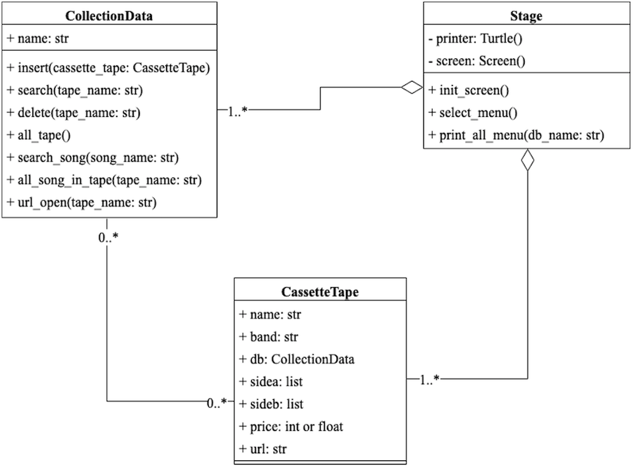
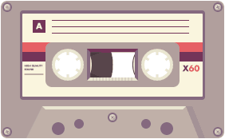

# Cassette Tape Collection
This program is a part of the 01219114 Computer Programming 1 course. It's also 
intended to create a cassette tape collection for those of you who, like myself, 
enjoy collecting cassette tapes. 

## Overview and features
   The main program will ask user for cassette tape data, which will be collected in collection data (If there is no any data file).
It's also has other menus for the user to choose and print out the results.

**For the user's convenience, the program includes seven menus from which they can choose:**
* Insert new tape.
* Search tape from collection.
* Delete tape from collection.
* Show all cassette tapes in collection.
* Find song from cassette tapes.
* Show all song in cassette tape.
* Open cassette tape on youtube.

## The program's requirement

Three Python modules are also used in this program. 
* [`turtle`](https://docs.python.org/3/library/turtle.html), which is used for the graphical part.
* [`os`](https://docs.python.org/3/library/os.html?highlight=os#module-os), which is used to browse a URL.
* [`json`](https://docs.python.org/3/library/json.html?highlight=json#module-json), which is used for data collection.

For better experience please download font [`Consolas`](Consolas.ttf) into your computer.

## About design
There are 3 classes in my project.
* `CassetteTape`: This class attributes will be basic info about cassette tape, which is used to create each
   cassette tape data.
* `CollectionData`: This class will read and write a file as a json file in order to access data from cassette tapes as in user's collection.
* `Stage`: This class is used to create all of the graphical output in this program such as print all the menus for user to choose.

And here is class diagram of the program.

## Code structure

This program consists of four python files and another one json file for collection example.

* [cassette.py](cassette.py): This file contains the `CassetteTape` class.
* [data.py](data.py): This file contains the `CollectionData` class.
* [stage.py](stage.py): This file contains the `Stage` class.
* [app](app.py): This file is used to run the main program.
* [tape_example](tape_example.json): This file is an example of cassette tape collection.

### I hope you find my work interesting, thank you :)

(pic from [here](https://images.app.goo.gl/NsaGK3WighNjwq2i8))
